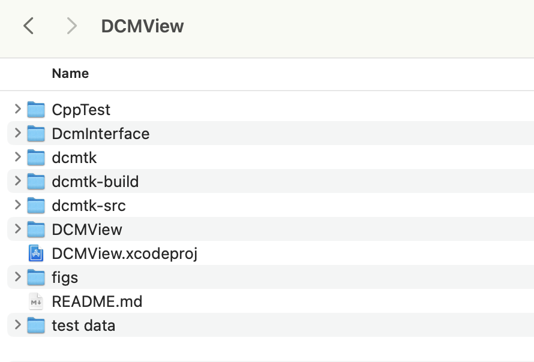

# DCMView
Light weight DICOM viewer on macOS

## Build DCMTK for Standalone macOS App

### Required tools
* Xcode (or LLVM-clang build system)
* cmake (use homebrew to install it)


### A note on dicom data dictionary
Almost all DCMTK tools and libraries require the so-called DICOM data dictionary, i.e., information from part 6 of the DICOM standard, to be available in order to map the attribute tags to their associated Value Representation (VR), Value Multiplicity (VM) and attribute name (official keyword).  

The data dictionary can either be
* loaded from file (default on Unix systems), or 
* built into the respective tool / dcmdata library (default on Windows systems).

The default behavior can be changed using appropriate configuration options.

#### To configure dicom data dictionary to be built into the library on Unix systems
When building with CMake, the related option is:
* DCMTK_DEFAULT_DICT

Possible values for this option are:
* "external": Compile with external default dictionary
* "builtin" : Compile with built-in default dictionary
* "none"    : Compile without any default dictionary (same as "disable")


### How to build dcmtk
Get source code from GitHub repository
```shell
> mkdir work && cd work
> git clone git@github.com:DCMTK/dcmtk.git
> mv dcmtk dcmtk-src
```

#### Build
```shell
> mkdir dcmtk-build && cd dcmtk-build
> cmake -DDCMTK_DEFAULT_DICT="builtin" ../dcmtk-src
> make -j
> make DESTDIR=../dcmtk install
> cd ../dcmtk && mv ./usr/local/* ./
> rm -rf ./usr
```

After building the DCMTK, move the three directories, `dcmtk`, `dcmtk-build`, and `dcmtk-src` to the project directory.




## TODO

* Inversion of image
* Histogram equalization
* Pixel value & coordinate display
* Statistics in selected region
* Profile plot 
* Zoom in/out
* DICOM tag display
